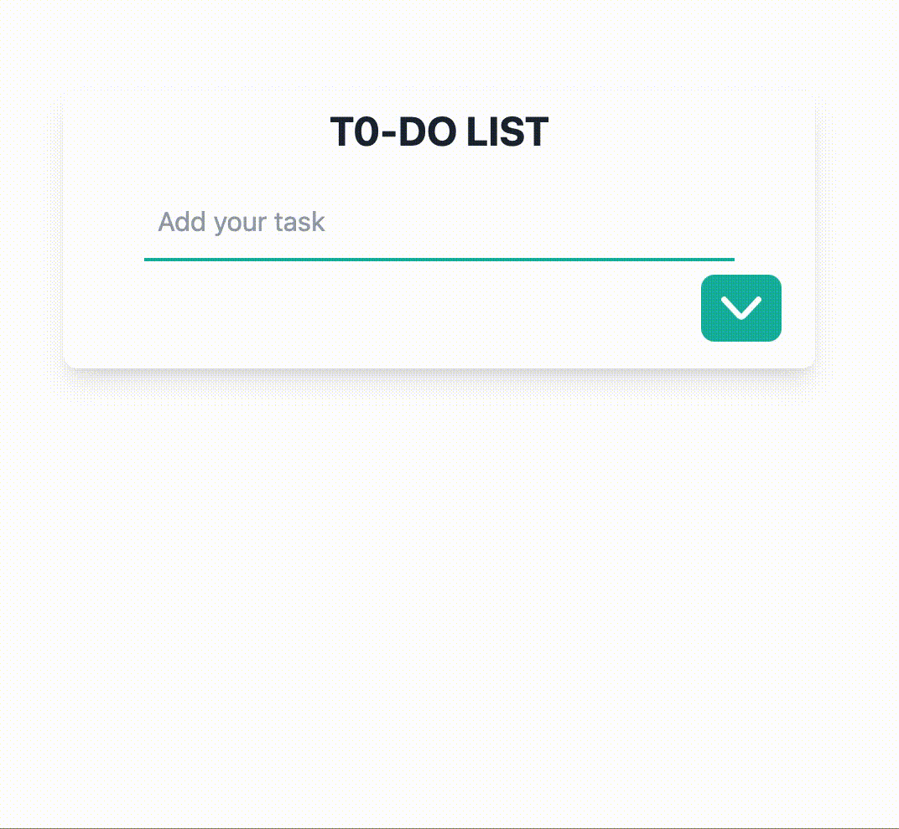

# To- Do App

## Description

This is a full-stack To-Do app that allows users to perform CRUD (Create, Read, Update, Delete) operations on their tasks. The app is built using a variety of technologies for both the backend and frontend.

## Backend

The backend of the app is powered by Express, Knex, and SQLite. Express is used as the web server framework, Knex as the SQL query builder, and SQLite as the database to store task information. Zod is use to validate the data.

### Setup 
To set up the backend, follow these steps::

1. Install dependencies: `npm install`
2. Run migrations: `npm run knex migrate:latest`
3. Start the server:: `npm run dev`

The server will start on port 5173. You can access the application at `http://localhost:5173/`.

## Frontend

The frontend is developed using Vite, React, Redux, Redux Toolkit, Redux AsyncThunk, Typescript and Tailwind CSS. Vite is used as the build tool, React for building user interfaces, Redux for state management, Redux Toolkit for simplifying Redux setup, Redux AsyncThunk for handling asynchronous actions, and Tailwind CSS for styling. Components are testing with Vitest

## Technologies
- React
- Typescript
- Tailwind CSS
- Redux toolkit
- Vite
- Vitest
- Express
- Knex
- SQLite3
- Zod

## Features

- Create new tasks
- Read and view existing tasks
- Update task details
- Delete tasks

## Contributing

If you want to contribute to this project, please open an issue or a pull request.

## License

This project is licensed under the MIT License.

[def]: /Users/rocioperalta/Desktop/Porfolio/to-do-app/public/todofunction.gif